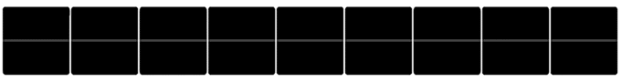

# Awesome Mobile UI

A curated list of awesome mobile UI/UX libraries.Both Android and iOS.

[Awesome Mobile UI](https://github.com/cymcsg/Awesome-Mobile-UI) 

Have fun!

* Animation
* Badges
* Dialog
* Effect
* Image
* Layout
* List
* Other
* Parallax
* RefreshControls
* Table

## ALL

* iOS:
  
  | Name                                     | Demo                                     |
  | ---------------------------------------- | ---------------------------------------- |
  | [DGElasticPullToRefresh](https://github.com/gontovnik/DGElasticPullToRefresh)    Language:Swift |  |
  | [ios-charts](https://github.com/danielgindi/ios-charts)          Language:Swift |  |
  | [SFFocusViewLayout](https://github.com/fdzsergio/SFFocusViewLayout) Language:Objective-C |  |
  | [KLParallaxView](https://github.com/klop/KLParallaxView) Language:Objective-C |  |
  | [GooeyTabbar](https://github.com/KittenYang/GooeyTabbar)   Language:Swift |  |
  | [Splitflap](https://github.com/yannickl/Splitflap)             Language:Swift |     |
  | [MYBlurIntroductionView](https://github.com/MatthewYork/MYBlurIntroductionView) Language:Objective-C |  |
  | [MRProgress](https://github.com/mrackwitz/MRProgress) Language:Objective-C |  |
  | [Onboard](https://github.com/mamaral/Onboard) Language:Objective-C |  |
  | [M13ProgressSuite](https://github.com/Marxon13/M13ProgressSuite) Language:Objective-C |  |
  | [FFCircularProgressView](https://github.com/elbryan/FFCircularProgressView) Language:Objective-C |  |
  | [CBStoreHouseRefreshControl](https://github.com/coolbeet/CBStoreHouseRefreshControl) Language:Objective-C |  |
  | [BOZPongRefreshControl](https://github.com/boztalay/BOZPongRefreshControl) Language:Objective-C |  |
  | [PullToRefreshCoreText](https://github.com/cemolcay/PullToRefreshCoreText) Language:Objective-C |  |
  | [PulsingHalo](https://github.com/shu223/PulsingHalo) Language:Objective-C |  |
  | [WobbleView](https://github.com/inFullMobile/WobbleView) Language:Objective-C |           |
  | [RZTransitions](https://github.com/Raizlabs/RZTransitions) Language:Objective-C |  |
  | [AnimatedTransitionGallery](https://github.com/shu223/AnimatedTransitionGallery) Language:Objective-C |  |
  | [KLCPopup](https://github.com/jmascia/KLCPopup)   Language:Objective-C |       |
  | [BLKFlexibleHeightBar](https://github.com/bryankeller/BLKFlexibleHeightBar) Language:Objective-C |  |
  | [CSStickyHeaderFlowLayout](https://github.com/jamztang/CSStickyHeaderFlowLayout) Language:Objective-C |  |
  | [FoldingTabBar.iOS](https://github.com/Yalantis/FoldingTabBar.iOS) Language:Objective-C |  |
  | [REFrostedViewController](https://github.com/romaonthego/REFrostedViewController)  Language:Objective-C |  |
  | [MinimalTabBar](https://github.com/jamesdunay/MinimalTabBar) Language:Objective-C |  |
  | [adaptive-tab-bar](https://github.com/Ramotion/adaptive-tab-bar) Language:Objective-C |  |
  | [BreakOutToRefresh](https://github.com/dasdom/BreakOutToRefresh) Language:Swift |  |
  | [BWWalkthrough](https://github.com/ariok/BWWalkthrough) Language:Swift |  |
  | [AMScrollingNavbar](https://github.com/andreamazz/AMScrollingNavbar) Language:Swift |  |
  | [GuillotineMenu](https://github.com/Yalantis/GuillotineMenu) Language:Swift |  |
  
  ​

