# Awesome Mobile UI

A curated list of awesome mobile UI/UX libraries.Both Android and iOS.

The list will add some Html5 library and Dribble project later.

[https://github.com/cymcsg/Awesome-Mobile-UI](https://github.com/cymcsg/Awesome-Mobile-UI) 

Have fun! Feel free to contribute!

* Animation
* Badges
* Dialog
* Effect
* Image
* Layout
* List
* Other
* Parallax
* RefreshControls
* Table

## ALL

* iOS:

| Name                                     | Demo                                     |
| ---------------------------------------- | ---------------------------------------- |
| [DGElasticPullToRefresh](https://github.com/gontovnik/DGElasticPullToRefresh)    Language:Swift |  |
| [ios-charts](https://github.com/danielgindi/ios-charts)          Language:Swift |  |
| [SFFocusViewLayout](https://github.com/fdzsergio/SFFocusViewLayout) Language:Objective-C |  |
| [KLParallaxView](https://github.com/klop/KLParallaxView) Language:Objective-C |  |
| [GooeyTabbar](https://github.com/KittenYang/GooeyTabbar)   Language:Swift |  |
| [Splitflap](https://github.com/yannickl/Splitflap)             Language:Swift |     |
| [MYBlurIntroductionView](https://github.com/MatthewYork/MYBlurIntroductionView) Language:Objective-C |  |
| [MRProgress](https://github.com/mrackwitz/MRProgress) Language:Objective-C |  |
| [Onboard](https://github.com/mamaral/Onboard) Language:Objective-C |  |
| [M13ProgressSuite](https://github.com/Marxon13/M13ProgressSuite) Language:Objective-C |  |
| [FFCircularProgressView](https://github.com/elbryan/FFCircularProgressView) Language:Objective-C |  |
| [CBStoreHouseRefreshControl](https://github.com/coolbeet/CBStoreHouseRefreshControl) Language:Objective-C |  |
| [BOZPongRefreshControl](https://github.com/boztalay/BOZPongRefreshControl) Language:Objective-C |  |
| [PullToRefreshCoreText](https://github.com/cemolcay/PullToRefreshCoreText) Language:Objective-C |  |
| [PulsingHalo](https://github.com/shu223/PulsingHalo) Language:Objective-C |  |
| [WobbleView](https://github.com/inFullMobile/WobbleView) Language:Objective-C |           |
| [RZTransitions](https://github.com/Raizlabs/RZTransitions) Language:Objective-C |  |
| [AnimatedTransitionGallery](https://github.com/shu223/AnimatedTransitionGallery) Language:Objective-C |  |
| [KLCPopup](https://github.com/jmascia/KLCPopup)   Language:Objective-C |       |
| [BLKFlexibleHeightBar](https://github.com/bryankeller/BLKFlexibleHeightBar) Language:Objective-C |  |
| [CSStickyHeaderFlowLayout](https://github.com/jamztang/CSStickyHeaderFlowLayout) Language:Objective-C |  |
| [FoldingTabBar.iOS](https://github.com/Yalantis/FoldingTabBar.iOS) Language:Objective-C |  |
| [REFrostedViewController](https://github.com/romaonthego/REFrostedViewController)  Language:Objective-C |  |
| [MinimalTabBar](https://github.com/jamesdunay/MinimalTabBar) Language:Objective-C |  |
| [adaptive-tab-bar](https://github.com/Ramotion/adaptive-tab-bar) Language:Objective-C |  |
| [BreakOutToRefresh](https://github.com/dasdom/BreakOutToRefresh) Language:Swift |  |
| [BWWalkthrough](https://github.com/ariok/BWWalkthrough) Language:Swift |  |
| [AMScrollingNavbar](https://github.com/andreamazz/AMScrollingNavbar) Language:Swift |  |
| [GuillotineMenu](https://github.com/Yalantis/GuillotineMenu) Language:Swift |  |
| [GoogleWearAlert](https://github.com/AshRobinson/GoogleWearAlert) Language:Swift |   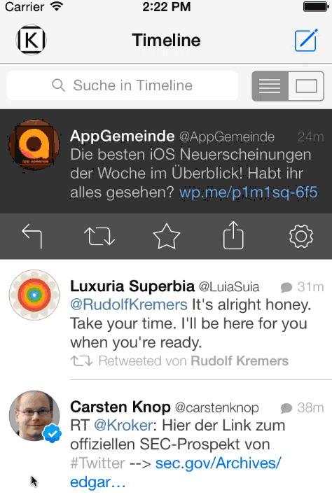 |
| [GMStepper](https://github.com/gmertk/GMStepper) Language:Swift |     |
| [GaugeKit](https://github.com/skywinder/GaugeKit) Language:Swift |       |
| [FrostedSidebar](https://github.com/edekhayser/FrostedSidebar) Language:Swift |  |
| [FloatRatingView](https://github.com/strekfus/FloatRatingView) Language:Swift |  |
| [FloatLabelFields](https://github.com/FahimF/FloatLabelFields) Language:Swift | 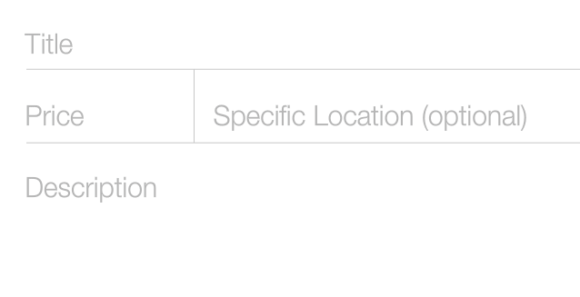 |
| [FillableLoaders](https://github.com/poolqf/FillableLoaders) Language:Swift |     |
| [ENSwiftSideMenu](https://github.com/evnaz/ENSwiftSideMenu) Language:Swift |  |
| [CozyLoadingActivity](https://github.com/goktugyil/CozyLoadingActivity) Language:Swift |   |
| [CharacterText](https://github.com/android1989/CharacterText) Language:Swift | 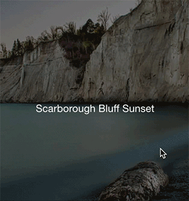  |
| [BubbleTransition](https://github.com/andreamazz/BubbleTransition) Language:Swift |  |
| [LTMorphingLabel](https://github.com/lexrus/LTMorphingLabel) Language:Swift |             |
[Panoramic](https://github.com/iSame7/Panoramic) Language:Swift | 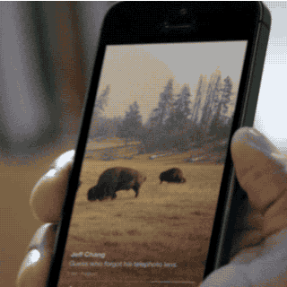    |
| [LiquidLoader](https://github.com/yoavlt/LiquidLoader) Language:Swift |    |
| [NVActivityIndicatorView](https://github.com/ninjaprox/NVActivityIndicatorView) Language:Swift |  |
| [MaterialKit](https://github.com/nghialv/MaterialKit) Language:Swift |   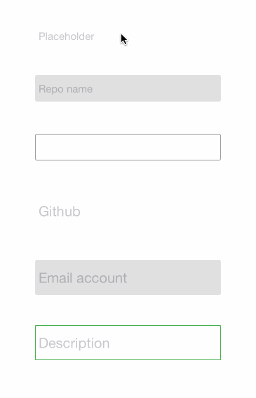  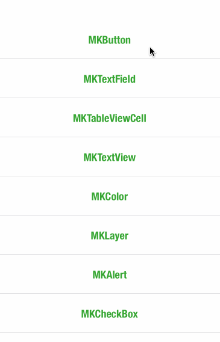  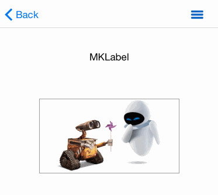 |
| [RubberBandEffect](https://github.com/Produkt/RubberBandEffect) Language:Swift |   |
| [StarWars.iOS](https://github.com/Yalantis/StarWars.iOS) Language:Swift |  |
| [SweetAlert-iOS](https://github.com/codestergit/SweetAlert-iOS) Language:Swift |  |
| [SAHistoryNavigationViewController](https://github.com/szk-atmosphere/SAHistoryNavigationViewController) Language:Swift |   |
| [SwiftyDrop](https://github.com/morizotter/SwiftyDrop) Language:Swift |   |
| [Twinkle](https://github.com/piemonte/Twinkle) Language:Swift |         |
| [PinterestSwift](https://github.com/demonnico/PinterestSwift) Language:Swift |  |
[PhotoStack](https://github.com/tomlongo/PhotoStack) Language:OC| 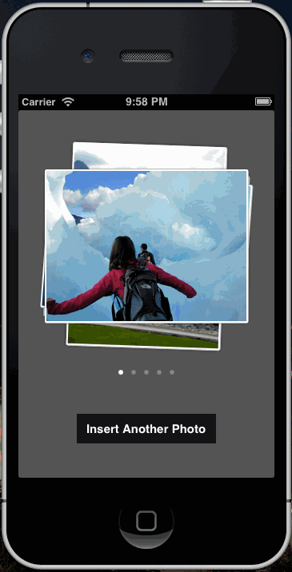 |
  [beautifulApp](https://github.com/lyimin/beautifulApp?luicode=10000359) Language:Swift|  |
[WXTabBarController](https://github.com/leichunfeng/WXTabBarController?luicode=10000359) Language:OC|  |
[SCNavigationControlCenter](https://github.com/SergioChan/SCNavigationControlCenter?luicode=10000359) Language:OC|  |
[Instructions](https://github.com/ephread/Instructions?luicode=10000359) Language:Swift| 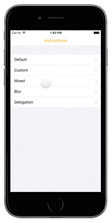 |
 [ADo_MinToMaxSlider](https://github.com/Nododo/ADo_MinToMaxSlider?luicode=10000359) Language:OC| 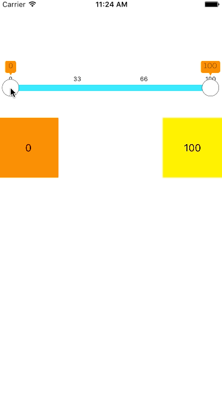 |
 [SCCatWaitingHUD](https://github.com/SergioChan/SCCatWaitingHUD?luicode=10000359) Language:OC|  |
  [awesome-animatio](https://github.com/Animatious/awesome-animation?luicode=10000359) Language:OC| 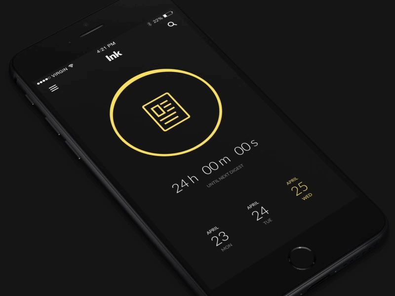 |
    [animated-tab-bar](https://github.com/Ramotion/animated-tab-bar?luicode=10000359) Language:Swift|  |
   [JZMultiChoicesCircleButton](https://github.com/JustinFincher/JZMultiChoicesCircleButton?luicode=10000359) Language:OC|  |
   [TKSubmitTransition](https://github.com/entotsu/TKSubmitTransition?url_type=39&object_type=webpage&pos=1&luicode=10000359) Language:Swift|  |
 [ADo_OpotionView](https://github.com/Nododo/ADo_OpotionView?luicode=10000359) Language:OC| 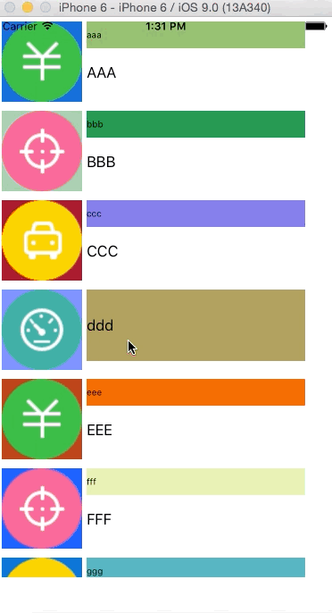 | 
  [RazzleDazzle](https://github.com/IFTTT/RazzleDazzle) Language:OC|  | 
   
 * Android:
 
| Name                                     | Demo                                     |
| ---------------------------------------- | ---------------------------------------- |
| [UltimateAndroid](https://github.com/cymcsg/UltimateAndroid)    Language:Java | 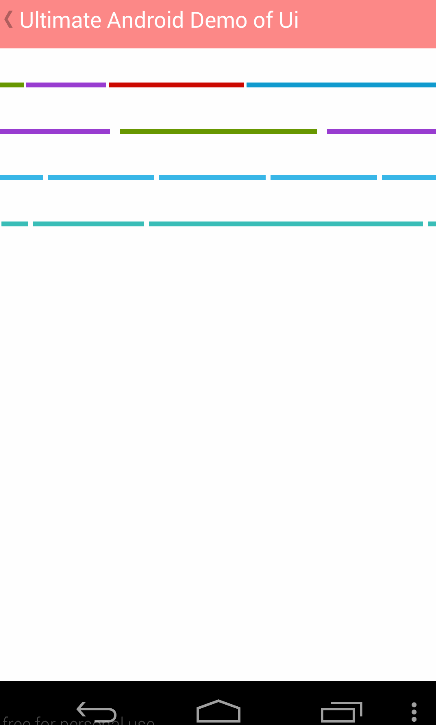       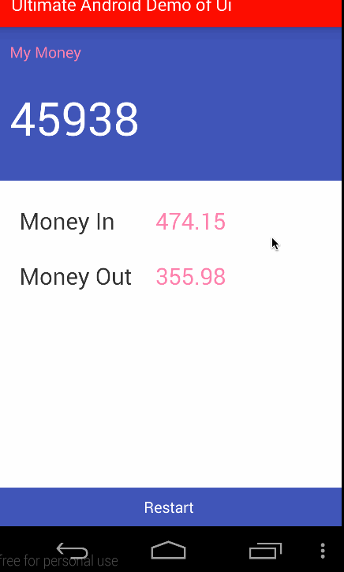     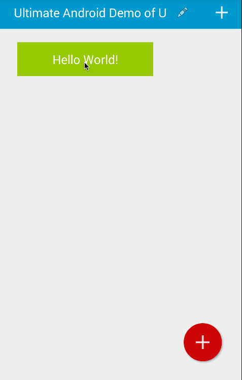   |
| [ElasticProgressBar](https://github.com/michelelacorte/ElasticProgressBar) |    |
| [ElasticDownload](https://github.com/Tibolte/ElasticDownload) |    |
| [StarWars.Android](https://github.com/Yalantis/StarWars.Android)  |  |